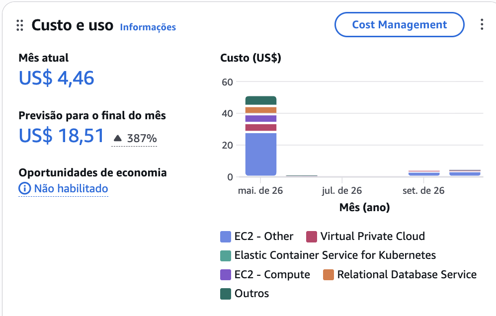

# Relatório de Entrega — Tech Challenge Fase 3

**PosTech DevOps** · ToggleMaster: IaC, CI/CD, DevSecOps e GitOps

## Participantes

- Steferson Patake
- [PREENCHER: demais integrantes do grupo, se houver]

## Links

| Item | Link |
|---|---|
| Repositório (código e documentação) | https://github.com/stefersonpatake/postech-fase-3 |
| Documentação | [README.md](../README.md) e pasta [docs/](.) (um passo a passo por etapa) |
| Vídeo de demonstração | [PREENCHER: link do vídeo] |

## Resumo da solução

| Requisito | Entrega |
|---|---|
| **IaC** | Terraform em duas camadas com state remoto em S3 (`use_lockfile`): `infra` (VPC, EKS, 3 RDS PostgreSQL, ElastiCache Redis, DynamoDB, SQS, 5 ECR, Secrets Manager) e `platform` (ArgoCD, External Secrets, AWS Load Balancer Controller via Helm). 8 módulos próprios. LabRole por data source |
| **CI / DevSecOps** | GitHub Actions: um workflow por microsserviço sobre dois pipelines reutilizáveis (Go e Python). Build e testes unitários, lint, SCA (Trivy fs), SAST (gosec/bandit + SonarCloud), build da imagem, container scan (Trivy image), push no ECR com tag `v1.0.0-<hash>`. Vulnerabilidade crítica interrompe o pipeline |
| **CD / GitOps** | Pasta `gitops/` com manifestos Kustomize. O último job do pipeline altera a tag da imagem no Git; o ArgoCD (ApplicationSet, uma Application por serviço) sincroniza automaticamente com prune e self-heal |

## Decisões tomadas

1. **AWS Academy, sem criar IAM.** Cluster e nós usam a `LabRole` obtida por data source.
2. **Pods usam a role do nó.** No Academy não é possível criar IRSA nem Pod Identity. Com o IMDS do
   nó configurado com *hop limit* 2, os pods herdam credenciais temporárias da LabRole, renovadas
   pela própria AWS. Isso eliminou o CronJob que renovava credenciais na Fase 2 e qualquer chave
   estática no cluster. Limitação assumida: todos os pods compartilham a mesma role.
3. **Segredos fora do Git e fora das mãos.** O Terraform gera as senhas dos bancos e grava no
   Secrets Manager; o External Secrets Operator as entrega aos pods. Ninguém digita nem vê as senhas.
4. **Duas camadas de Terraform.** A camada `platform` usa o provider Helm, que precisa do cluster já
   existente; separar os states evita a dependência circular e permite recriar tudo com um script.
5. **Módulos próprios.** Os módulos da comunidade criam roles de IAM por padrão, o que o Academy bloqueia.
6. **Monorepo com pasta `gitops/` e Kustomize.** O CI faz o commit da nova tag com o token do próprio
   workflow, sem credenciais extras. A tag fica em `kustomization.yaml`, ponto único de alteração.
7. **ApplicationSet no lugar de Applications escritas à mão.** Uma pasta nova em `gitops/apps/` vira
   uma Application automaticamente.
8. **Regra de bloqueio em dois níveis.** CRITICAL no Trivy; HIGH no gosec/bandit (nível máximo dessas
   ferramentas). Achados abaixo disso são reportados no log sem bloquear.
9. **Um único ALB** para os 5 serviços, com reescrita de caminho, no lugar do ingress-nginx
   (descontinuado) usado na Fase 2.
10. **Ambiente descartável.** Scripts `infra-up.sh` e `infra-down.sh` recriam e destroem tudo; o
    ambiente só fica ligado durante as sessões de trabalho.

## Desafios encontrados

| Desafio | Como foi resolvido |
|---|---|
| **SCP do Academy bloqueia a leitura de *object lock* do S3**, que o provider AWS faz em todo `aws_s3_bucket` | O bucket de state é criado por um script idempotente com AWS CLI (`terraform/bootstrap/bootstrap.sh`) |
| **`terraform apply` do EKS interrompido** com o cluster ainda em criação: recurso existia na AWS, mas não no state | `terraform import` do cluster e novo `apply` apenas do que faltava |
| **`infra-down` interrompido** deixou lock órfão no S3 e state desatualizado (56 recursos listados, 2 existentes) | `terraform force-unlock` e novo `apply`: o Terraform detectou os recursos ausentes e recriou 38 |
| **Corrida na instalação dos charts**: o webhook do ALB Controller intercepta a criação de todo `Service` e ainda não estava pronto | `depends_on` dos demais charts para o ALB Controller |
| **`SERVICE_API_KEY` só existe em runtime** (emitida pelo auth-service) | Secret criado pelo Terraform com valor provisório e `ignore_changes`; script emite a chave de dentro do pod e grava no Secrets Manager |
| **Erros 502 durante o rolling update** | *Pod readiness gate* do ALB e `preStop`; teste com 120 requisições durante o restart: 120 respostas 200 |
| **Credenciais do Academy expiram a cada sessão** e não há OIDC entre GitHub e AWS | Script `sync-gh-secrets.sh` atualiza os GitHub Secrets; no cluster não há credenciais a renovar |
| **Vulnerabilidades reais apontadas pelo pipeline** | SSRF no evaluation-service (gosec, HIGH): validação do nome da flag e escape do caminho. CVEs críticas nas imagens (Go 1.21, pacotes Debian): novas imagens base. Containers como root (SonarCloud): usuário sem privilégios |
| **Vários pipelines atualizando `gitops/` ao mesmo tempo** | Job de GitOps com retentativas a partir do estado mais recente da `main`; validado com 5 serviços simultâneos |

## Resultados

- Ambiente completo criado do zero por código em ~20 minutos (62 recursos Terraform em duas camadas).
- 5 pipelines com 5 estágios cada; 28 testes unitários; 0 vulnerabilidades críticas nas imagens publicadas.
- Deploy sem acesso humano (nem do CI) ao cluster: do merge ao pod atualizado em poucos minutos.
- Teste ponta a ponta automatizado (`scripts/test-services.sh`): autenticação, cadastro de flag e
  regra, avaliação, evento via SQS até o DynamoDB.

## Estimativa de custos da AWS

### Custo real e previsão (console AWS, painel "Custo e uso", 04/10/2026)

| Indicador | Valor |
|---|---:|
| Gasto acumulado no mês (outubro, até o dia 4) | US$ 4,46 |
| Previsão da AWS para o fechamento do mês | US$ 18,51 |

O valor é baixo porque o ambiente **não fica ligado continuamente**: é criado por
`./scripts/infra-up.sh` no início de cada sessão de trabalho e destruído por
`./scripts/infra-down.sh` ao final. Os principais componentes do gasto são EC2 (nós do EKS, NAT e
volumes), VPC, EKS e RDS, coerentes com a arquitetura provisionada.

### Estimativa com o ambiente ligado 24×7

Valores aproximados de tabela (us-east-1, on-demand); detalhamento e itens para a AWS Pricing
Calculator em [CUSTOS.md](CUSTOS.md).

| Recurso | US$/mês |
|---|---:|
| EC2 — 3 nós `t3.medium` + EBS | ~96 |
| EKS (control plane) | 73 |
| RDS — 3 × `db.t3.micro` + armazenamento | ~46 |
| NAT Gateway | ~33 |
| Application Load Balancer | ~22 |
| ElastiCache — `cache.t3.micro` | ~12 |
| IPv4 públicos | ~11 |
| Secrets Manager, DynamoDB, SQS, ECR, S3 | ~4 |
| **Total** | **~298** (≈ US$ 0,41/h) |

A diferença entre os ~US$ 298 de um ambiente permanente e os ~US$ 18 previstos para o mês é o
ganho direto de ter toda a infraestrutura como código: o ambiente existe apenas enquanto é usado.
